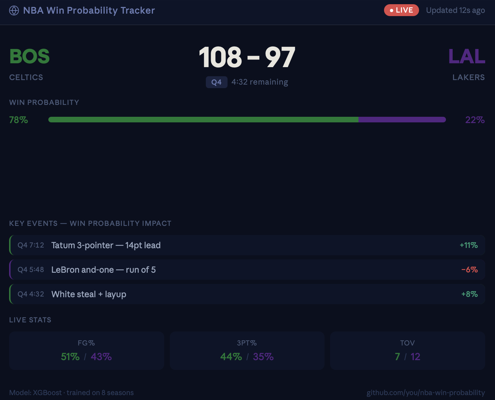

# LiveWinningProbabilityTracker 📊🏀🏆

As a big basket-ball fan I was wondering why not combining my passion with the skills I developped during my studies. This is what gave birth to this project. 

The goal of this project is to build a Basket-ball live winning probability tracker. I will be using some scraping technics to retrieve the live data (score, minutes left to play, team with possession...) in order to build a dataset that will be used to train some ML models (XGBoost, LSTM,...) and a final dashboard to have access to the live probability.

